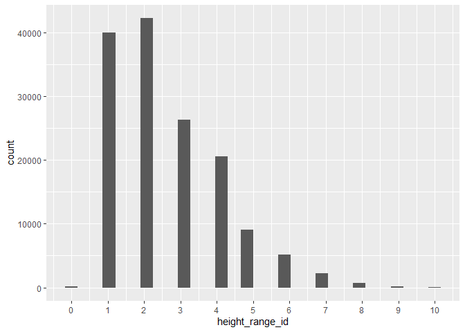
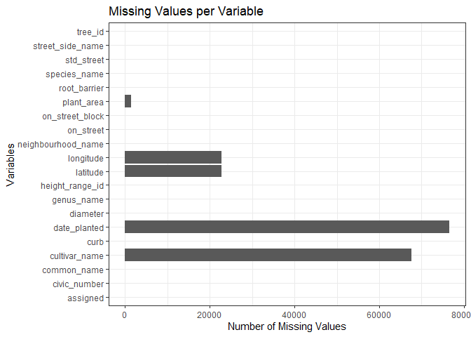
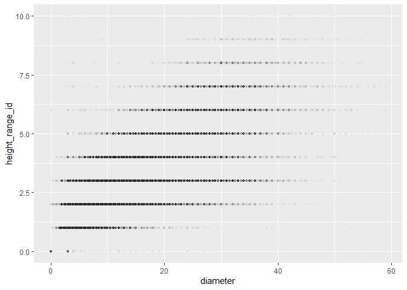
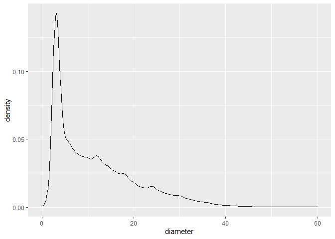

Mini Data-Analysis Deliverable 1
================

# Welcome to your (maybe) first-ever data analysis project!

And hopefully the first of many. Let’s get started:

1.  Install the [`datateachr`](https://github.com/UBC-MDS/datateachr)
    package by typing the following into your **R terminal**:

<!-- -->

    install.packages("devtools")
    devtools::install_github("UBC-MDS/datateachr")

2.  Load the packages below.

``` r
library(datateachr)
library(tidyverse)
```

    ## ── Attaching core tidyverse packages ──────────────────────── tidyverse 2.0.0 ──
    ## ✔ dplyr     1.1.3     ✔ readr     2.1.4
    ## ✔ forcats   1.0.0     ✔ stringr   1.5.0
    ## ✔ ggplot2   3.4.3     ✔ tibble    3.2.1
    ## ✔ lubridate 1.9.2     ✔ tidyr     1.3.0
    ## ✔ purrr     1.0.2     
    ## ── Conflicts ────────────────────────────────────────── tidyverse_conflicts() ──
    ## ✖ dplyr::filter() masks stats::filter()
    ## ✖ dplyr::lag()    masks stats::lag()
    ## ℹ Use the conflicted package (<http://conflicted.r-lib.org/>) to force all conflicts to become errors

3.  Make a repository in the <https://github.com/stat545ubc-2023>
    Organization. You can do this by following the steps found on canvas
    in the entry called [MDA: Create a
    repository](https://canvas.ubc.ca/courses/126199/pages/mda-create-a-repository).
    One completed, your repository should automatically be listed as
    part of the stat545ubc-2023 Organization.

# Instructions

## For Both Milestones

- Each milestone has explicit tasks. Tasks that are more challenging
  will often be allocated more points.

- Each milestone will be also graded for reproducibility, cleanliness,
  and coherence of the overall Github submission.

- While the two milestones will be submitted as independent
  deliverables, the analysis itself is a continuum - think of it as two
  chapters to a story. Each chapter, or in this case, portion of your
  analysis, should be easily followed through by someone unfamiliar with
  the content.
  [Here](https://swcarpentry.github.io/r-novice-inflammation/06-best-practices-R/)
  is a good resource for what constitutes “good code”. Learning good
  coding practices early in your career will save you hassle later on!

- The milestones will be equally weighted.

## For Milestone 1

**To complete this milestone**, edit [this very `.Rmd`
file](https://raw.githubusercontent.com/UBC-STAT/stat545.stat.ubc.ca/master/content/mini-project/mini-project-1.Rmd)
directly. Fill in the sections that are tagged with
`<!--- start your work below --->`.

**To submit this milestone**, make sure to knit this `.Rmd` file to an
`.md` file by changing the YAML output settings from
`output: html_document` to `output: github_document`. Commit and push
all of your work to the mini-analysis GitHub repository you made
earlier, and tag a release on GitHub. Then, submit a link to your tagged
release on canvas.

**Points**: This milestone is worth 36 points: 30 for your analysis, and
6 for overall reproducibility, cleanliness, and coherence of the Github
submission.

# Learning Objectives

By the end of this milestone, you should:

- Become familiar with your dataset of choosing
- Select 4 questions that you would like to answer with your data
- Generate a reproducible and clear report using R Markdown
- Become familiar with manipulating and summarizing your data in tibbles
  using `dplyr`, with a research question in mind.

# Task 1: Choose your favorite dataset

The `datateachr` package by Hayley Boyce and Jordan Bourak currently
composed of 7 semi-tidy datasets for educational purposes. Here is a
brief description of each dataset:

- *apt_buildings*: Acquired courtesy of The City of Toronto’s Open Data
  Portal. It currently has 3455 rows and 37 columns.

- *building_permits*: Acquired courtesy of The City of Vancouver’s Open
  Data Portal. It currently has 20680 rows and 14 columns.

- *cancer_sample*: Acquired courtesy of UCI Machine Learning Repository.
  It currently has 569 rows and 32 columns.

- *flow_sample*: Acquired courtesy of The Government of Canada’s
  Historical Hydrometric Database. It currently has 218 rows and 7
  columns.

- *parking_meters*: Acquired courtesy of The City of Vancouver’s Open
  Data Portal. It currently has 10032 rows and 22 columns.

- *steam_games*: Acquired courtesy of Kaggle. It currently has 40833
  rows and 21 columns.

- *vancouver_trees*: Acquired courtesy of The City of Vancouver’s Open
  Data Portal. It currently has 146611 rows and 20 columns.

**Things to keep in mind**

- We hope that this project will serve as practice for carrying our your
  own *independent* data analysis. Remember to comment your code, be
  explicit about what you are doing, and write notes in this markdown
  document when you feel that context is required. As you advance in the
  project, prompts and hints to do this will be diminished - it’ll be up
  to you!

- Before choosing a dataset, you should always keep in mind **your
  goal**, or in other ways, *what you wish to achieve with this data*.
  This mini data-analysis project focuses on *data wrangling*,
  *tidying*, and *visualization*. In short, it’s a way for you to get
  your feet wet with exploring data on your own.

And that is exactly the first thing that you will do!

1.1 **(1 point)** Out of the 7 datasets available in the `datateachr`
package, choose **4** that appeal to you based on their description.
Write your choices below:

**Note**: We encourage you to use the ones in the `datateachr` package,
but if you have a dataset that you’d really like to use, you can include
it here. But, please check with a member of the teaching team to see
whether the dataset is of appropriate complexity. Also, include a
**brief** description of the dataset here to help the teaching team
understand your data.

<!-------------------------- Start your work below ---------------------------->

1: building_permits 2: flow_sample 3: steam_games 4: vancouver_trees

<!----------------------------------------------------------------------------->

1.2 **(6 points)** One way to narrowing down your selection is to
*explore* the datasets. Use your knowledge of dplyr to find out at least
*3* attributes about each of these datasets (an attribute is something
such as number of rows, variables, class type…). The goal here is to
have an idea of *what the data looks like*.

*Hint:* This is one of those times when you should think about the
cleanliness of your analysis. I added a single code chunk for you below,
but do you want to use more than one? Would you like to write more
comments outside of the code chunk?

<!-------------------------- Start your work below ---------------------------->

### 1. *building_permits*

``` r
### EXPLORE HERE ###
glimpse(building_permits)
```

    ## Rows: 20,680
    ## Columns: 14
    ## $ permit_number               <chr> "BP-2016-02248", "BU468090", "DB-2016-0445…
    ## $ issue_date                  <date> 2017-02-01, 2017-02-01, 2017-02-01, 2017-…
    ## $ project_value               <dbl> 0, 0, 35000, 15000, 181178, 0, 15000, 0, 6…
    ## $ type_of_work                <chr> "Salvage and Abatement", "New Building", "…
    ## $ address                     <chr> "4378 W 9TH AVENUE, Vancouver, BC V6R 2C7"…
    ## $ project_description         <chr> NA, NA, NA, NA, NA, NA, NA, NA, NA, NA, NA…
    ## $ building_contractor         <chr> NA, NA, NA, "Mercury Contracting Ltd", "08…
    ## $ building_contractor_address <chr> NA, NA, NA, "88 W PENDER ST  \r\nUnit 2069…
    ## $ applicant                   <chr> "Raffaele & Associates DBA: Raffaele and A…
    ## $ applicant_address           <chr> "2642 East Hastings\r\nVancouver, BC  V5K …
    ## $ property_use                <chr> "Dwelling Uses", "Dwelling Uses", "Dwellin…
    ## $ specific_use_category       <chr> "One-Family Dwelling", "Multiple Dwelling"…
    ## $ year                        <dbl> 2017, 2017, 2017, 2017, 2017, 2017, 2017, …
    ## $ bi_id                       <dbl> 524, 535, 539, 541, 543, 546, 547, 548, 54…

``` r
building_permits %>% head() 
```

    ## # A tibble: 6 × 14
    ##   permit_number issue_date project_value type_of_work          address          
    ##   <chr>         <date>             <dbl> <chr>                 <chr>            
    ## 1 BP-2016-02248 2017-02-01             0 Salvage and Abatement 4378 W 9TH AVENU…
    ## 2 BU468090      2017-02-01             0 New Building          1111 RICHARDS ST…
    ## 3 DB-2016-04450 2017-02-01         35000 Addition / Alteration 3732 W 12TH AVEN…
    ## 4 DB-2017-00131 2017-02-01         15000 Addition / Alteration 88 W PENDER STRE…
    ## 5 DB452250      2017-02-01        181178 New Building          492 E 62ND AVENU…
    ## 6 BP-2016-01458 2017-02-02             0 Salvage and Abatement 3332 W 28TH AVEN…
    ## # ℹ 9 more variables: project_description <chr>, building_contractor <chr>,
    ## #   building_contractor_address <chr>, applicant <chr>,
    ## #   applicant_address <chr>, property_use <chr>, specific_use_category <chr>,
    ## #   year <dbl>, bi_id <dbl>

As shown above, there are 20680 rows and 14 columns in the
*apt_buildings* dataset in total.There are 3 different data types, which
are chr, date and dbl respectively. The variables are listed below:

- permit_number  
- issue_date  
- project_value  
- type_of_work  
- address  
- project_description  
- building_contractor  
- building_contractor_address
- applicant  
- applicant_address  
- property_use  
- specific_use_category  
- year  
- bi_id

### 2. *flow_sample*

``` r
glimpse(flow_sample)
```

    ## Rows: 218
    ## Columns: 7
    ## $ station_id   <chr> "05BB001", "05BB001", "05BB001", "05BB001", "05BB001", "0…
    ## $ year         <dbl> 1909, 1910, 1911, 1912, 1913, 1914, 1915, 1916, 1917, 191…
    ## $ extreme_type <chr> "maximum", "maximum", "maximum", "maximum", "maximum", "m…
    ## $ month        <dbl> 7, 6, 6, 8, 6, 6, 6, 6, 6, 6, 6, 7, 6, 6, 6, 7, 5, 7, 6, …
    ## $ day          <dbl> 7, 12, 14, 25, 11, 18, 27, 20, 17, 15, 22, 3, 9, 5, 14, 5…
    ## $ flow         <dbl> 314, 230, 264, 174, 232, 214, 236, 309, 174, 345, 185, 24…
    ## $ sym          <chr> NA, NA, NA, NA, NA, NA, NA, NA, NA, NA, NA, NA, NA, NA, N…

``` r
flow_sample %>% head()
```

    ## # A tibble: 6 × 7
    ##   station_id  year extreme_type month   day  flow sym  
    ##   <chr>      <dbl> <chr>        <dbl> <dbl> <dbl> <chr>
    ## 1 05BB001     1909 maximum          7     7   314 <NA> 
    ## 2 05BB001     1910 maximum          6    12   230 <NA> 
    ## 3 05BB001     1911 maximum          6    14   264 <NA> 
    ## 4 05BB001     1912 maximum          8    25   174 <NA> 
    ## 5 05BB001     1913 maximum          6    11   232 <NA> 
    ## 6 05BB001     1914 maximum          6    18   214 <NA>

As shown above, there are 218 rows and 7 columns in the *flow_sample*
dataset in total.There are 2 different data types, which are chr and dbl
respectively. The variables are listed below:

- station_id
- year
- extreme_type
- month
- day
- flow
- sym

### 3. *parking_meters*

``` r
glimpse(parking_meters)
```

    ## Rows: 10,032
    ## Columns: 22
    ## $ meter_head     <chr> "Twin", "Pay Station", "Twin", "Single", "Twin", "Twin"…
    ## $ r_mf_9a_6p     <chr> "$2.00", "$1.00", "$1.00", "$1.00", "$2.00", "$2.00", "…
    ## $ r_mf_6p_10     <chr> "$4.00", "$1.00", "$1.00", "$1.00", "$1.00", "$1.00", "…
    ## $ r_sa_9a_6p     <chr> "$2.00", "$1.00", "$1.00", "$1.00", "$2.00", "$2.00", "…
    ## $ r_sa_6p_10     <chr> "$4.00", "$1.00", "$1.00", "$1.00", "$1.00", "$1.00", "…
    ## $ r_su_9a_6p     <chr> "$2.00", "$1.00", "$1.00", "$1.00", "$2.00", "$2.00", "…
    ## $ r_su_6p_10     <chr> "$4.00", "$1.00", "$1.00", "$1.00", "$1.00", "$1.00", "…
    ## $ rate_misc      <chr> NA, "$ .50", NA, NA, NA, NA, NA, NA, NA, NA, NA, NA, NA…
    ## $ time_in_effect <chr> "METER IN EFFECT: 9:00 AM TO 10:00 PM", "METER IN EFFEC…
    ## $ t_mf_9a_6p     <chr> "2 Hr", "10 Hrs", "2 Hr", "2 Hr", "2 Hr", "3 Hr", "2 Hr…
    ## $ t_mf_6p_10     <chr> "4 Hr", "10 Hrs", "4 Hr", "4 Hr", "4 Hr", "4 Hr", "4 Hr…
    ## $ t_sa_9a_6p     <chr> "2 Hr", "10 Hrs", "2 Hr", "2 Hr", "2 Hr", "3 Hr", "2 Hr…
    ## $ t_sa_6p_10     <chr> "4 Hr", "10 Hrs", "4 Hr", "4 Hr", "4 Hr", "4 Hr", "4 Hr…
    ## $ t_su_9a_6p     <chr> "2 Hr", "10 Hrs", "2 Hr", "2 Hr", "2 Hr", "3 Hr", "2 Hr…
    ## $ t_su_6p_10     <chr> "4 Hr", "10 Hrs", "4 Hr", "4 Hr", "4 Hr", "4 Hr", "4 Hr…
    ## $ time_misc      <chr> NA, "No Time Limit", NA, NA, NA, NA, NA, NA, NA, NA, NA…
    ## $ credit_card    <chr> "No", "Yes", "No", "No", "No", "No", "No", "No", "No", …
    ## $ pay_phone      <chr> "66890", "59916", "57042", "57159", "51104", "60868", "…
    ## $ longitude      <dbl> -123.1289, -123.0982, -123.1013, -123.1862, -123.1278, …
    ## $ latitude       <dbl> 49.28690, 49.27215, 49.25468, 49.26341, 49.26354, 49.27…
    ## $ geo_local_area <chr> "West End", "Strathcona", "Riley Park", "West Point Gre…
    ## $ meter_id       <chr> "670805", "471405", "C80145", "D03704", "301023", "5913…

``` r
parking_meters %>% head()
```

    ## # A tibble: 6 × 22
    ##   meter_head  r_mf_9a_6p r_mf_6p_10 r_sa_9a_6p r_sa_6p_10 r_su_9a_6p r_su_6p_10
    ##   <chr>       <chr>      <chr>      <chr>      <chr>      <chr>      <chr>     
    ## 1 Twin        $2.00      $4.00      $2.00      $4.00      $2.00      $4.00     
    ## 2 Pay Station $1.00      $1.00      $1.00      $1.00      $1.00      $1.00     
    ## 3 Twin        $1.00      $1.00      $1.00      $1.00      $1.00      $1.00     
    ## 4 Single      $1.00      $1.00      $1.00      $1.00      $1.00      $1.00     
    ## 5 Twin        $2.00      $1.00      $2.00      $1.00      $2.00      $1.00     
    ## 6 Twin        $2.00      $1.00      $2.00      $1.00      $2.00      $1.00     
    ## # ℹ 15 more variables: rate_misc <chr>, time_in_effect <chr>, t_mf_9a_6p <chr>,
    ## #   t_mf_6p_10 <chr>, t_sa_9a_6p <chr>, t_sa_6p_10 <chr>, t_su_9a_6p <chr>,
    ## #   t_su_6p_10 <chr>, time_misc <chr>, credit_card <chr>, pay_phone <chr>,
    ## #   longitude <dbl>, latitude <dbl>, geo_local_area <chr>, meter_id <chr>

As shown above, there are 10032 rows and 22 columns in the
*parking_meters* dataset in total. There are 2 different data types,
which are chr and dbl respectively. The variables are listed below:

- meter_head  
- r_mf_9a_6p  
- r_mf_6p_10  
- r_sa_9a_6p  
- r_sa_6p_10  
- r_su_9a_6p  
- su_6p_10  
- rate_misc  
- time_in_effect
- t_mf_9a_6p  
- t_mf_6p_10  
- t_sa_9a_6p  
- t_sa_6p_10  
- t_su_9a_6p  
- t_su_6p_10  
- time_misc  
- credit_card  
- pay_phone  
- longitude  
- latitude  
- geo_local_area
- meter_id

### 4. *vancouver_trees*

``` r
glimpse(vancouver_trees)
```

    ## Rows: 146,611
    ## Columns: 20
    ## $ tree_id            <dbl> 149556, 149563, 149579, 149590, 149604, 149616, 149…
    ## $ civic_number       <dbl> 494, 450, 4994, 858, 5032, 585, 4909, 4925, 4969, 7…
    ## $ std_street         <chr> "W 58TH AV", "W 58TH AV", "WINDSOR ST", "E 39TH AV"…
    ## $ genus_name         <chr> "ULMUS", "ZELKOVA", "STYRAX", "FRAXINUS", "ACER", "…
    ## $ species_name       <chr> "AMERICANA", "SERRATA", "JAPONICA", "AMERICANA", "C…
    ## $ cultivar_name      <chr> "BRANDON", NA, NA, "AUTUMN APPLAUSE", NA, "CHANTICL…
    ## $ common_name        <chr> "BRANDON ELM", "JAPANESE ZELKOVA", "JAPANESE SNOWBE…
    ## $ assigned           <chr> "N", "N", "N", "Y", "N", "N", "N", "N", "N", "N", "…
    ## $ root_barrier       <chr> "N", "N", "N", "N", "N", "N", "N", "N", "N", "N", "…
    ## $ plant_area         <chr> "N", "N", "4", "4", "4", "B", "6", "6", "3", "3", "…
    ## $ on_street_block    <dbl> 400, 400, 4900, 800, 5000, 500, 4900, 4900, 4900, 7…
    ## $ on_street          <chr> "W 58TH AV", "W 58TH AV", "WINDSOR ST", "E 39TH AV"…
    ## $ neighbourhood_name <chr> "MARPOLE", "MARPOLE", "KENSINGTON-CEDAR COTTAGE", "…
    ## $ street_side_name   <chr> "EVEN", "EVEN", "EVEN", "EVEN", "EVEN", "ODD", "ODD…
    ## $ height_range_id    <dbl> 2, 4, 3, 4, 2, 2, 3, 3, 2, 2, 2, 5, 3, 2, 2, 2, 2, …
    ## $ diameter           <dbl> 10.00, 10.00, 4.00, 18.00, 9.00, 5.00, 15.00, 14.00…
    ## $ curb               <chr> "N", "N", "Y", "Y", "Y", "Y", "Y", "Y", "Y", "Y", "…
    ## $ date_planted       <date> 1999-01-13, 1996-05-31, 1993-11-22, 1996-04-29, 19…
    ## $ longitude          <dbl> -123.1161, -123.1147, -123.0846, -123.0870, -123.08…
    ## $ latitude           <dbl> 49.21776, 49.21776, 49.23938, 49.23469, 49.23894, 4…

``` r
vancouver_trees %>% head()
```

    ## # A tibble: 6 × 20
    ##   tree_id civic_number std_street genus_name species_name cultivar_name  
    ##     <dbl>        <dbl> <chr>      <chr>      <chr>        <chr>          
    ## 1  149556          494 W 58TH AV  ULMUS      AMERICANA    BRANDON        
    ## 2  149563          450 W 58TH AV  ZELKOVA    SERRATA      <NA>           
    ## 3  149579         4994 WINDSOR ST STYRAX     JAPONICA     <NA>           
    ## 4  149590          858 E 39TH AV  FRAXINUS   AMERICANA    AUTUMN APPLAUSE
    ## 5  149604         5032 WINDSOR ST ACER       CAMPESTRE    <NA>           
    ## 6  149616          585 W 61ST AV  PYRUS      CALLERYANA   CHANTICLEER    
    ## # ℹ 14 more variables: common_name <chr>, assigned <chr>, root_barrier <chr>,
    ## #   plant_area <chr>, on_street_block <dbl>, on_street <chr>,
    ## #   neighbourhood_name <chr>, street_side_name <chr>, height_range_id <dbl>,
    ## #   diameter <dbl>, curb <chr>, date_planted <date>, longitude <dbl>,
    ## #   latitude <dbl>

As shown above, there are 146611 rows and 20 columns in the
*vancouver_trees* dataset in total. There are 3 different data types,
which are chr, date and dbl respectively. The variables are listed
below:

- tree_id
- civic_number
- std_street
- genus_name
- species_name
- cultivar_name
- common_name
- assigned
- root_barrier
- plant_area
- on_street_block
- on_street
- neighbourhood_name
- street_side_name
- height_range_id
- diameter
- curb
- date_planted
- longitude
- latitude

<!----------------------------------------------------------------------------->

1.3 **(1 point)** Now that you’ve explored the 4 datasets that you were
initially most interested in, let’s narrow it down to 1. What lead you
to choose this one? Briefly explain your choice below.

<!-------------------------- Start your work below ---------------------------->

I will choose the dataset *vancouver_trees*.

First, from the result of 1.2 We can find that the number of rows in
dataset A is much smaller than other datasets, which may be because it
was too simple and not suitable for further in-depth research.

Next, we calculate the percentage of NA values in the remaining
datasets.

``` r
#*building_permits*
missing_values <- colSums(is.na(building_permits))
percentage_missing <- (missing_values / nrow(building_permits)) * 100
data.frame( Missing_Count = missing_values, Percentage_Missing=percentage_missing)
```

    ##                             Missing_Count Percentage_Missing
    ## permit_number                           0         0.00000000
    ## issue_date                              0         0.00000000
    ## project_value                          52         0.25145068
    ## type_of_work                            0         0.00000000
    ## address                                22         0.10638298
    ## project_description                  6734        32.56286267
    ## building_contractor                  8070        39.02321083
    ## building_contractor_address         11474        55.48355899
    ## applicant                               0         0.00000000
    ## applicant_address                      30         0.14506770
    ## property_use                            5         0.02417795
    ## specific_use_category                   6         0.02901354
    ## year                                    0         0.00000000
    ## bi_id                                   0         0.00000000

``` r
sum(is.na(building_permits)) / (sum(is.na(building_permits)) + sum(!is.na(building_permits)))
```

    ## [1] 0.09116123

``` r
#*parking_meters*
missing_values <- colSums(is.na(parking_meters))
percentage_missing <- (missing_values / nrow(parking_meters)) * 100
data.frame( Missing_Count = missing_values, Percentage_Missing=percentage_missing)
```

    ##                Missing_Count Percentage_Missing
    ## meter_head                 0         0.00000000
    ## r_mf_9a_6p                20         0.19936204
    ## r_mf_6p_10                20         0.19936204
    ## r_sa_9a_6p                23         0.22926635
    ## r_sa_6p_10                20         0.19936204
    ## r_su_9a_6p                23         0.22926635
    ## r_su_6p_10                20         0.19936204
    ## rate_misc               9218        91.88596491
    ## time_in_effect            37         0.36881978
    ## t_mf_9a_6p                29         0.28907496
    ## t_mf_6p_10                24         0.23923445
    ## t_sa_9a_6p                22         0.21929825
    ## t_sa_6p_10                24         0.23923445
    ## t_su_9a_6p                22         0.21929825
    ## t_su_6p_10                23         0.22926635
    ## time_misc               9551        95.20534290
    ## credit_card               16         0.15948963
    ## pay_phone                  4         0.03987241
    ## longitude                  0         0.00000000
    ## latitude                   0         0.00000000
    ## geo_local_area             0         0.00000000
    ## meter_id                   0         0.00000000

``` r
sum(is.na(parking_meters)) / (sum(is.na(parking_meters)) + sum(!is.na(parking_meters)))
```

    ## [1] 0.08652313

``` r
#*vancouver_trees*
missing_values <- colSums(is.na(vancouver_trees))
percentage_missing <- (missing_values / nrow(vancouver_trees)) * 100
data.frame( Missing_Count = missing_values, Percentage_Missing=percentage_missing)
```

    ##                    Missing_Count Percentage_Missing
    ## tree_id                        0           0.000000
    ## civic_number                   0           0.000000
    ## std_street                     0           0.000000
    ## genus_name                     0           0.000000
    ## species_name                   0           0.000000
    ## cultivar_name              67559          46.080444
    ## common_name                    0           0.000000
    ## assigned                       0           0.000000
    ## root_barrier                   0           0.000000
    ## plant_area                  1486           1.013567
    ## on_street_block                0           0.000000
    ## on_street                      0           0.000000
    ## neighbourhood_name             0           0.000000
    ## street_side_name               0           0.000000
    ## height_range_id                0           0.000000
    ## diameter                       0           0.000000
    ## curb                           0           0.000000
    ## date_planted               76548          52.211635
    ## longitude                  22771          15.531577
    ## latitude                   22771          15.531577

``` r
sum(is.na(vancouver_trees)) / (sum(is.na(vancouver_trees)) + sum(!is.na(vancouver_trees)))
```

    ## [1] 0.0651844

As shown in the result, we could find that among these three datasets,
the *vancouver_trees* is is the most complete. Hence, I choose this to
do further research.

<!----------------------------------------------------------------------------->

1.4 **(2 points)** Time for a final decision! Going back to the
beginning, it’s important to have an *end goal* in mind. For example, if
I had chosen the `titanic` dataset for my project, I might’ve wanted to
explore the relationship between survival and other variables. Try to
think of 1 research question that you would want to answer with your
dataset. Note it down below.

<!-------------------------- Start your work below ---------------------------->

I will choose dataset *vancouver_trees* to continue this project. I am
curious about What are the key factors influencing the growth and health
of trees in Vancouver. I also want to explore the potential relationship
between trees’ heights, diameter and geographic location.
<!----------------------------------------------------------------------------->

# Important note

Read Tasks 2 and 3 *fully* before starting to complete either of them.
Probably also a good point to grab a coffee to get ready for the fun
part!

This project is semi-guided, but meant to be *independent*. For this
reason, you will complete tasks 2 and 3 below (under the **START HERE**
mark) as if you were writing your own exploratory data analysis report,
and this guidance never existed! Feel free to add a brief introduction
section to your project, format the document with markdown syntax as you
deem appropriate, and structure the analysis as you deem appropriate. If
you feel lost, you can find a sample data analysis
[here](https://www.kaggle.com/headsortails/tidy-titarnic) to have a
better idea. However, bear in mind that it is **just an example** and
you will not be required to have that level of complexity in your
project.

# Task 2: Exploring your dataset

If we rewind and go back to the learning objectives, you’ll see that by
the end of this deliverable, you should have formulated *4* research
questions about your data that you may want to answer during your
project. However, it may be handy to do some more exploration on your
dataset of choice before creating these questions - by looking at the
data, you may get more ideas. **Before you start this task, read all
instructions carefully until you reach START HERE under Task 3**.

2.1 **(12 points)** Complete *4 out of the following 8 exercises* to
dive deeper into your data. All datasets are different and therefore,
not all of these tasks may make sense for your data - which is why you
should only answer *4*.

Make sure that you’re using dplyr and ggplot2 rather than base R for
this task. Outside of this project, you may find that you prefer using
base R functions for certain tasks, and that’s just fine! But part of
this project is for you to practice the tools we learned in class, which
is dplyr and ggplot2.

1.  Plot the distribution of a numeric variable.
2.  Create a new variable based on other variables in your data (only if
    it makes sense)
3.  Investigate how many missing values there are per variable. Can you
    find a way to plot this?
4.  Explore the relationship between 2 variables in a plot.
5.  Filter observations in your data according to your own criteria.
    Think of what you’d like to explore - again, if this was the
    `titanic` dataset, I may want to narrow my search down to passengers
    born in a particular year…
6.  Use a boxplot to look at the frequency of different observations
    within a single variable. You can do this for more than one variable
    if you wish!
7.  Make a new tibble with a subset of your data, with variables and
    observations that you are interested in exploring.
8.  Use a density plot to explore any of your variables (that are
    suitable for this type of plot).

2.2 **(4 points)** For each of the 4 exercises that you complete,
provide a *brief explanation* of why you chose that exercise in relation
to your data (in other words, why does it make sense to do that?), and
sufficient comments for a reader to understand your reasoning and code.

<!-------------------------- Start your work below ---------------------------->

## 2.1 & 2.2

### Exercise 1

I choose to plot the distribution of trees’ height_range_id. The
height_range_id is a numeric variable which is an important indicator of
trees’ growth and health.

``` r
answer2.1 <- ggplot(vancouver_trees, aes(x = height_range_id)) +
   geom_histogram() +
   scale_x_continuous(breaks = seq(0, 10, by = 1))
answer2.1
```

    ## `stat_bin()` using `bins = 30`. Pick better value with `binwidth`.

<!-- -->

From the graph, we can see that the values of height_range_id are mainly
concentrated between 1 and 5.

### Exercise 3

I try to count the missing values for each variable and make a plot for
the result. In section 1.3, I have calculate the percentage of NA values
in the dataset *vancouver_trees*, so this time we need to plot the
result.

``` r
#calculate the number of missing values per variable
answer2.2 <- vancouver_trees %>%
  summarise_all(~sum(is.na(.)))
answer2.2
```

    ## # A tibble: 1 × 20
    ##   tree_id civic_number std_street genus_name species_name cultivar_name
    ##     <int>        <int>      <int>      <int>        <int>         <int>
    ## 1       0            0          0          0            0         67559
    ## # ℹ 14 more variables: common_name <int>, assigned <int>, root_barrier <int>,
    ## #   plant_area <int>, on_street_block <int>, on_street <int>,
    ## #   neighbourhood_name <int>, street_side_name <int>, height_range_id <int>,
    ## #   diameter <int>, curb <int>, date_planted <int>, longitude <int>,
    ## #   latitude <int>

``` r
#reshape the data into a longer format
missing_counts <- answer2.2 %>%
  gather(key = "Variable", value = "Missing_Count")
#create a bar plot
ggplot(data = missing_counts, aes(x = Variable, y = Missing_Count)) +
  geom_col() +
  theme_bw() +
  labs(title = "Missing Values per Variable",
       x = "Variables",
       y = "Number of Missing Values") + 
  coord_flip()
```

<!-- -->

### Exercise 4

I choose to explore the relationship between the height_range_id and
diameter in a plot, because I want to explore the potential relationship
between these two factors originally.

``` r
vancouver_trees %>%
  count(diameter_less_60 = (diameter < 60))
```

    ## # A tibble: 2 × 2
    ##   diameter_less_60      n
    ##   <lgl>             <int>
    ## 1 FALSE                67
    ## 2 TRUE             146544

First, we filter trees and keep trees with diameter higher than 60
inches, because there are only 67 trees with diameter higher than 60
inches among 146544 trees.

``` r
answer2.3 <- vancouver_trees %>% 
  filter(diameter < 60) %>% 
ggplot(aes(diameter, height_range_id)) +
 geom_point(size = 1,alpha = 0.01) 
print(answer2.3)
```

<!-- -->
From the graph, we can see that height_range_id and diameter have a
positive correlation to some extent.

### Exercise 8

I choose to use a density plot to explore the diameter of trees.
Diameter is a continuous numeric variable, which is suitable to use
density plots for visualizing the distribution.

``` r
answer2.4 <- ggplot(vancouver_trees, aes(x = diameter)) + 
    geom_density(alpha = 0.1) + 
    scale_x_continuous(limits = c(0, 60))
  
print(answer2.4)
```

    ## Warning: Removed 64 rows containing non-finite values (`stat_density()`).

<!-- -->

From the graph, we can see that the values of diameter are mainly
concentrated between 0 and 20 inches.
<!----------------------------------------------------------------------------->

# Task 3: Choose research questions

**(4 points)** So far, you have chosen a dataset and gotten familiar
with it through exploring the data. You have also brainstormed one
research question that interested you (Task 1.4). Now it’s time to pick
4 research questions that you would like to explore in Milestone 2!
Write the 4 questions and any additional comments below.

<!--- *****START HERE***** --->

- 1.  Is the Curb presence one of the important factors affecting the
      diameter or height of trees?

- 2.  Is the root_barrier one of the important factors affecting the
      diameter or height of trees?

- 3.  What is the relationship between the height and diameter of a tree
      and its genus and age?

- 4.  Is the distribution of different types of trees related to their
      geographical location or neighborhood of cultivation?
      <!----------------------------->

# Overall reproducibility/Cleanliness/Coherence Checklist

## Coherence (0.5 points)

The document should read sensibly from top to bottom, with no major
continuity errors. An example of a major continuity error is having a
data set listed for Task 3 that is not part of one of the data sets
listed in Task 1.

## Error-free code (3 points)

For full marks, all code in the document should run without error. 1
point deduction if most code runs without error, and 2 points deduction
if more than 50% of the code throws an error.

## Main README (1 point)

There should be a file named `README.md` at the top level of your
repository. Its contents should automatically appear when you visit the
repository on GitHub.

Minimum contents of the README file:

- In a sentence or two, explains what this repository is, so that
  future-you or someone else stumbling on your repository can be
  oriented to the repository.
- In a sentence or two (or more??), briefly explains how to engage with
  the repository. You can assume the person reading knows the material
  from STAT 545A. Basically, if a visitor to your repository wants to
  explore your project, what should they know?

Once you get in the habit of making README files, and seeing more README
files in other projects, you’ll wonder how you ever got by without them!
They are tremendously helpful.

## Output (1 point)

All output is readable, recent and relevant:

- All Rmd files have been `knit`ted to their output md files.
- All knitted md files are viewable without errors on Github. Examples
  of errors: Missing plots, “Sorry about that, but we can’t show files
  that are this big right now” messages, error messages from broken R
  code
- All of these output files are up-to-date – that is, they haven’t
  fallen behind after the source (Rmd) files have been updated.
- There should be no relic output files. For example, if you were
  knitting an Rmd to html, but then changed the output to be only a
  markdown file, then the html file is a relic and should be deleted.

(0.5 point deduction if any of the above criteria are not met. 1 point
deduction if most or all of the above criteria are not met.)

Our recommendation: right before submission, delete all output files,
and re-knit each milestone’s Rmd file, so that everything is up to date
and relevant. Then, after your final commit and push to Github, CHECK on
Github to make sure that everything looks the way you intended!

## Tagged release (0.5 points)

You’ve tagged a release for Milestone 1.

### Attribution

Thanks to Icíar Fernández Boyano for mostly putting this together, and
Vincenzo Coia for launching.
