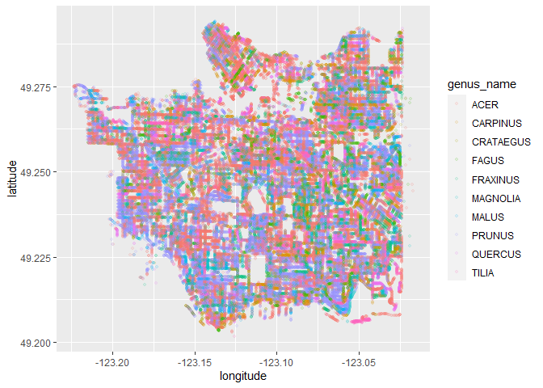

Mini Data Analysis Milestone 2
================

*To complete this milestone, you can either edit [this `.rmd`
file](https://raw.githubusercontent.com/UBC-STAT/stat545.stat.ubc.ca/master/content/mini-project/mini-project-2.Rmd)
directly. Fill in the sections that are commented out with
`<!--- start your work here--->`. When you are done, make sure to knit
to an `.md` file by changing the output in the YAML header to
`github_document`, before submitting a tagged release on canvas.*

# Welcome to the rest of your mini data analysis project!

In Milestone 1, you explored your data. and came up with research
questions. This time, we will finish up our mini data analysis and
obtain results for your data by:

- Making summary tables and graphs
- Manipulating special data types in R: factors and/or dates and times.
- Fitting a model object to your data, and extract a result.
- Reading and writing data as separate files.

We will also explore more in depth the concept of *tidy data.*

**NOTE**: The main purpose of the mini data analysis is to integrate
what you learn in class in an analysis. Although each milestone provides
a framework for you to conduct your analysis, it’s possible that you
might find the instructions too rigid for your data set. If this is the
case, you may deviate from the instructions – just make sure you’re
demonstrating a wide range of tools and techniques taught in this class.

# Instructions

**To complete this milestone**, edit [this very `.Rmd`
file](https://raw.githubusercontent.com/UBC-STAT/stat545.stat.ubc.ca/master/content/mini-project/mini-project-2.Rmd)
directly. Fill in the sections that are tagged with
`<!--- start your work here--->`.

**To submit this milestone**, make sure to knit this `.Rmd` file to an
`.md` file by changing the YAML output settings from
`output: html_document` to `output: github_document`. Commit and push
all of your work to your mini-analysis GitHub repository, and tag a
release on GitHub. Then, submit a link to your tagged release on canvas.

**Points**: This milestone is worth 50 points: 45 for your analysis, and
5 for overall reproducibility, cleanliness, and coherence of the Github
submission.

**Research Questions**: In Milestone 1, you chose two research questions
to focus on. Wherever realistic, your work in this milestone should
relate to these research questions whenever we ask for justification
behind your work. In the case that some tasks in this milestone don’t
align well with one of your research questions, feel free to discuss
your results in the context of a different research question.

# Learning Objectives

By the end of this milestone, you should:

- Understand what *tidy* data is, and how to create it using `tidyr`.
- Generate a reproducible and clear report using R Markdown.
- Manipulating special data types in R: factors and/or dates and times.
- Fitting a model object to your data, and extract a result.
- Reading and writing data as separate files.

# Setup

Begin by loading your data and the tidyverse package below:

``` r
library(datateachr) # <- might contain the data you picked!
library(tidyverse)
library(cowplot)
library(broom)
library(here)
```

# Task 1: Process and summarize your data

From milestone 1, you should have an idea of the basic structure of your
dataset (e.g. number of rows and columns, class types, etc.). Here, we
will start investigating your data more in-depth using various data
manipulation functions.

### 1.1 (1 point)

First, write out the 4 research questions you defined in milestone 1
were. This will guide your work through milestone 2:

<!-------------------------- Start your work below ---------------------------->

1.  *Is the Curb presence one of the important factors affecting the
    diameter of trees?*
2.  *Is the root_barrier one of the important factors affecting the
    height of trees?*
3.  *What is the relationship between the diameter of a tree and its
    age?*
4.  *Is the distribution of different types of trees related to their
    geographical location or neighborhood of cultivation?*
    <!----------------------------------------------------------------------------->

Here, we will investigate your data using various data manipulation and
graphing functions.

### 1.2 (8 points)

Now, for each of your four research questions, choose one task from
options 1-4 (summarizing), and one other task from 4-8 (graphing). You
should have 2 tasks done for each research question (8 total). Make sure
it makes sense to do them! (e.g. don’t use a numerical variables for a
task that needs a categorical variable.). Comment on why each task helps
(or doesn’t!) answer the corresponding research question.

Ensure that the output of each operation is printed!

Also make sure that you’re using dplyr and ggplot2 rather than base R.
Outside of this project, you may find that you prefer using base R
functions for certain tasks, and that’s just fine! But part of this
project is for you to practice the tools we learned in class, which is
dplyr and ggplot2.

**Summarizing:**

1.  Compute the *range*, *mean*, and *two other summary statistics* of
    **one numerical variable** across the groups of **one categorical
    variable** from your data.
2.  Compute the number of observations for at least one of your
    categorical variables. Do not use the function `table()`!
3.  Create a categorical variable with 3 or more groups from an existing
    numerical variable. You can use this new variable in the other
    tasks! *An example: age in years into “child, teen, adult, senior”.*
4.  Compute the proportion and counts in each category of one
    categorical variable across the groups of another categorical
    variable from your data. Do not use the function `table()`!

**Graphing:**

6.  Create a graph of your choosing, make one of the axes logarithmic,
    and format the axes labels so that they are “pretty” or easier to
    read.
7.  Make a graph where it makes sense to customize the alpha
    transparency.

Using variables and/or tables you made in one of the “Summarizing”
tasks:

8.  Create a graph that has at least two geom layers.
9.  Create 3 histograms, with each histogram having different sized
    bins. Pick the “best” one and explain why it is the best.

Make sure it’s clear what research question you are doing each operation
for!

<!------------------------- Start your work below ----------------------------->

### 1.*Is the Curb presence one of the important factors affecting the diameter of trees?*

**Summarizing:**

I will choose option 1 and compute the *range*, *mean*, *median*, and
*variance* of **diameter** across the groups of **curb** from
*vancouver_trees*.

``` r
answer1.21 <- vancouver_trees %>%
  group_by(curb) %>%
  summarise(range =  diff(range(diameter)), mean = mean(diameter),  median = median(diameter), variance = var(diameter))
answer1.21
```

    ## # A tibble: 2 × 5
    ##   curb  range  mean median variance
    ##   <chr> <dbl> <dbl>  <dbl>    <dbl>
    ## 1 N       161  12.6     10    107. 
    ## 2 Y       435  11.4      9     82.6

**Graphing:**

I will choose option 8 and create a graph that has at least two geom
layers based on the results.

``` r
p1 <- ggplot(answer1.21) +
  geom_col(aes(x = curb, y = range, fill = curb),position = position_dodge(),width = 0.4) +
  geom_text(aes(x = curb, y = range,label = range)) 
  
p2 <- ggplot(answer1.21) +
  geom_col(aes(x = curb, y = mean, fill = curb),position = position_dodge(),width = 0.4) +
  geom_text(aes(x = curb, y = mean,label = mean)) 

p3 <- ggplot(answer1.21) +
  geom_col(aes(x = curb, y = median, fill = curb),position = position_dodge(),width = 0.4) +
  geom_text(aes(x = curb, y = median,label = median)) 
  

p4 <- ggplot(answer1.21) +
  geom_col(aes(x = curb, y = variance, fill = curb),position = position_dodge(),width = 0.4) +
  geom_text(aes(x = curb, y = variance,label = variance)) 

plot_grid(p1, p2, p3, p4, labels = LETTERS[1:4], ncol = 2)
```

<!-- -->

### 2.*Is the root_barrier one of the important factors affecting the height of trees?*

**Summarizing:** I will choose option 1 and compute the *range*, *mean*,
*median*, and *variance* of **height_range_id** across the groups of
**root_barrier** from *vancouver_trees*.

``` r
answer1.22 <- vancouver_trees %>%
  group_by(root_barrier) %>%
  summarise(range =  diff(range(height_range_id)), mean = mean(height_range_id),  median = median(height_range_id), variance = var(height_range_id))
answer1.22
```

    ## # A tibble: 2 × 5
    ##   root_barrier range  mean median variance
    ##   <chr>        <dbl> <dbl>  <dbl>    <dbl>
    ## 1 N               10  2.72      2    2.39 
    ## 2 Y                9  1.30      1    0.438

**Graphing:**

I will choose option 8 and create a graph that has at least two geom
layers based on the results.

``` r
p1 <- ggplot(answer1.22) +
  geom_col(aes(x = root_barrier, y = range, fill = root_barrier),position = position_dodge(),width = 0.4) +
  geom_text(aes(x = root_barrier, y = range,label = range)) 
  
p2 <- ggplot(answer1.22) +
  geom_col(aes(x = root_barrier, y = mean, fill = root_barrier),position = position_dodge(),width = 0.4) +
  geom_text(aes(x = root_barrier, y = mean,label = mean)) 

p3 <- ggplot(answer1.22) +
  geom_col(aes(x = root_barrier, y = median, fill = root_barrier),position = position_dodge(),width = 0.4) +
  geom_text(aes(x = root_barrier, y = median,label = median)) 
  

p4 <- ggplot(answer1.22) +
  geom_col(aes(x = root_barrier, y = variance, fill = root_barrier),position = position_dodge(),width = 0.4) +
  geom_text(aes(x = root_barrier, y = variance,label = variance)) 

plot_grid(p1, p2, p3, p4, labels = LETTERS[1:4], ncol = 2)
```

<!-- -->

### 3.*What is the relationship between the diameter of a tree and its age?*

**Summarizing:** I will choose option 3 and create a categorical
variable with 3 or more groups from an existing numerical variable. In
this case, I will create a new categorical variable called
diameter_category based on the original value of diameters, which is
divided into three groups:

- 1.  low: 0 \< diameter \<= 5

- 2.  moderate: 5 \< diameter \<= 15

- 3.  high: diameter \> 15

``` r
answer1.23 <- vancouver_trees %>%
  select(tree_id, diameter) %>%
  mutate(diameter_categorty = factor(case_when(diameter <= 5 ~"low",
                                               diameter <= 15 ~"moderate",
                                               TRUE ~ "high"),
                                     levels = c('low', 'moderate', 'high'))) %>% 
  group_by(diameter_categorty) %>%
  count()
answer1.23
```

    ## # A tibble: 3 × 2
    ## # Groups:   diameter_categorty [3]
    ##   diameter_categorty     n
    ##   <fct>              <int>
    ## 1 low                50919
    ## 2 moderate           54490
    ## 3 high               41202

From the result, we could see that there are 50919 trees with low
diameter_categorty, 54490 trees with moderate diameter_categorty and
50919 trees with high diameter_categorty respectively.

**Graphing:** I will choose option 7 and make a graph where it makes
sense to customize the alpha transparency.In this case, I intend to
explore how age would affect trees’ diameter.

``` r
vancouver_trees %>%
  ggplot(aes(date_planted, diameter)) +
  geom_point(alpha = 0.01, size = 1, color = "blue") +
  scale_y_continuous(limits = c(0, 60))
```

    ## Warning: Removed 76564 rows containing missing values (`geom_point()`).

<!-- -->

Due to the fact that there are so many data points in the plot causing
overlapping, it make sense to change alpha transparency which can help
reveal the density of points.

### 4.*Is the distribution of different types of trees related to their geographical location or neighborhood of cultivation?*

**Summarizing:** I will choose option 2 and compute the number of
observations for the variable `genre_name`, and explore its potential
relationship with geographical location and neighborhood.

``` r
#compute the number of observations for the variable `genre_name` with different neighbourhood_name
answer1.25 <- vancouver_trees %>%
  group_by(neighbourhood_name, genus_name) %>%
  count()
answer1.25
```

    ## # A tibble: 1,303 × 3
    ## # Groups:   neighbourhood_name, genus_name [1,303]
    ##    neighbourhood_name genus_name      n
    ##    <chr>              <chr>       <int>
    ##  1 ARBUTUS-RIDGE      ABIES          18
    ##  2 ARBUTUS-RIDGE      ACER          867
    ##  3 ARBUTUS-RIDGE      AESCULUS      134
    ##  4 ARBUTUS-RIDGE      AMELANCHIER    19
    ##  5 ARBUTUS-RIDGE      BETULA         77
    ##  6 ARBUTUS-RIDGE      CALOCEDRUS      1
    ##  7 ARBUTUS-RIDGE      CARPINUS      167
    ##  8 ARBUTUS-RIDGE      CATALPA         5
    ##  9 ARBUTUS-RIDGE      CEDRUS         11
    ## 10 ARBUTUS-RIDGE      CELTIS          4
    ## # ℹ 1,293 more rows

**Graphing:** I will choose option 7 and make a graph where it makes
sense to customize the alpha transparency. In this section, I will make
a plot to show the geographical distribution of the top 10 planted
trees.

``` r
#count and sort genus_name
answer1.24 <- vancouver_trees %>%
  group_by(genus_name) %>%
  count() %>%
  arrange(-n)
answer1.25 <- answer1.24[1:10,]
answer1.25
```

    ## # A tibble: 10 × 2
    ## # Groups:   genus_name [10]
    ##    genus_name     n
    ##    <chr>      <int>
    ##  1 ACER       36062
    ##  2 PRUNUS     30683
    ##  3 FRAXINUS    7381
    ##  4 TILIA       6773
    ##  5 QUERCUS     6119
    ##  6 CARPINUS    5806
    ##  7 FAGUS       4808
    ##  8 MALUS       4173
    ##  9 MAGNOLIA    3899
    ## 10 CRATAEGUS   3864

``` r
answer1.26 <- vancouver_trees %>%
  filter(genus_name %in% answer1.25$genus_name) %>%
  ggplot(aes(x = longitude, y = latitude, color = genus_name)) +
  geom_point(alpha = 0.1, size = 1)
answer1.26
```

    ## Warning: Removed 15589 rows containing missing values (`geom_point()`).

<!-- -->

<!----------------------------------------------------------------------------->

### 1.3 (2 points)

Based on the operations that you’ve completed, how much closer are you
to answering your research questions? Think about what aspects of your
research questions remain unclear. Can your research questions be
refined, now that you’ve investigated your data a bit more? Which
research questions are yielding interesting results?

<!------------------------- Write your answer here ---------------------------->

### 1.*Is the Curb presence one of the important factors affecting the diameter of trees?*

Based on the results of 1.2, we could conclude that Curb presence is one
of the important factors that affect the diameter of trees. From the
plotted graph, we could find that compared with trees with no curb, the
diameter of trees with curbs has higher range, but their mean and median
value are lower. Besides, the variance of the diameter of curbed trees
are lower than those without curbs. However, we have not explore if the
presence of curb is related to genus, or if the effect of curb is
related to genus. I will revise this question and continue further
study.

### 2.*Is the root_barrier one of the important factors affecting the height of trees?*

Based on the results of 1.2, we could conclude that root_barrier is one
of the important factors that affect the height of trees. From the
plotted graph, we could find that compared with trees with no
root_barrier, the height of trees with root_barrier has lower mean and
median value. Besides, the variance and range of the height of trees
with root_barrier are also lower than others. However, I also notice
that the height_range_id is a approximation of trees’ height, which is
not precise enough to derive convinced results.

### 3.*What is the relationship between the diameter of a tree and its age?*

Based on the results of 1.2, we could find that older trees tend to have
higher diameter than young trees, as shown in the plotted graph.
However, given that we have not consider other factors affecting the
diameters such genus and geographical location, further research need to
be implemented to confirm our assumption. However,apart from ages, the
diameter of trees might also affected by trees’ genus. Further proof
need to be done to verify our conclusion.

### 4.*Is the distribution of different types of trees related to their geographical location or neighborhood of cultivation?*

Based on the results of 1.2, we still could not find any obvious laws
applied to the geographical distribution of different genres of trees. I
try to plot the top 10 planted trees and make them shown as a map, but
its hard to distinguish its distribution pattern with the naked eye.
Further research methods and algorithms might applied to help solve this
question.
<!----------------------------------------------------------------------------->

# Task 2: Tidy your data

In this task, we will do several exercises to reshape our data. The goal
here is to understand how to do this reshaping with the `tidyr` package.

A reminder of the definition of *tidy* data:

- Each row is an **observation**
- Each column is a **variable**
- Each cell is a **value**

### 2.1 (2 points)

Based on the definition above, can you identify if your data is tidy or
untidy? Go through all your columns, or if you have \>8 variables, just
pick 8, and explain whether the data is untidy or tidy.

<!--------------------------- Start your work below --------------------------->

``` r
glimpse(vancouver_trees)
```

    ## Rows: 146,611
    ## Columns: 20
    ## $ tree_id            <dbl> 149556, 149563, 149579, 149590, 149604, 149616, 149…
    ## $ civic_number       <dbl> 494, 450, 4994, 858, 5032, 585, 4909, 4925, 4969, 7…
    ## $ std_street         <chr> "W 58TH AV", "W 58TH AV", "WINDSOR ST", "E 39TH AV"…
    ## $ genus_name         <chr> "ULMUS", "ZELKOVA", "STYRAX", "FRAXINUS", "ACER", "…
    ## $ species_name       <chr> "AMERICANA", "SERRATA", "JAPONICA", "AMERICANA", "C…
    ## $ cultivar_name      <chr> "BRANDON", NA, NA, "AUTUMN APPLAUSE", NA, "CHANTICL…
    ## $ common_name        <chr> "BRANDON ELM", "JAPANESE ZELKOVA", "JAPANESE SNOWBE…
    ## $ assigned           <chr> "N", "N", "N", "Y", "N", "N", "N", "N", "N", "N", "…
    ## $ root_barrier       <chr> "N", "N", "N", "N", "N", "N", "N", "N", "N", "N", "…
    ## $ plant_area         <chr> "N", "N", "4", "4", "4", "B", "6", "6", "3", "3", "…
    ## $ on_street_block    <dbl> 400, 400, 4900, 800, 5000, 500, 4900, 4900, 4900, 7…
    ## $ on_street          <chr> "W 58TH AV", "W 58TH AV", "WINDSOR ST", "E 39TH AV"…
    ## $ neighbourhood_name <chr> "MARPOLE", "MARPOLE", "KENSINGTON-CEDAR COTTAGE", "…
    ## $ street_side_name   <chr> "EVEN", "EVEN", "EVEN", "EVEN", "EVEN", "ODD", "ODD…
    ## $ height_range_id    <dbl> 2, 4, 3, 4, 2, 2, 3, 3, 2, 2, 2, 5, 3, 2, 2, 2, 2, …
    ## $ diameter           <dbl> 10.00, 10.00, 4.00, 18.00, 9.00, 5.00, 15.00, 14.00…
    ## $ curb               <chr> "N", "N", "Y", "Y", "Y", "Y", "Y", "Y", "Y", "Y", "…
    ## $ date_planted       <date> 1999-01-13, 1996-05-31, 1993-11-22, 1996-04-29, 19…
    ## $ longitude          <dbl> -123.1161, -123.1147, -123.0846, -123.0870, -123.08…
    ## $ latitude           <dbl> 49.21776, 49.21776, 49.23938, 49.23469, 49.23894, 4…

Due to the fact that the dataset *vancouver_trees* contains more than 8
variables, I will pick 8 out of them and do further explanation.

``` r
answer2.11 <- vancouver_trees %>%
  reframe(tree_id, civic_number, std_street, genus_name, species_name, common_name, assigned, root_barrier)
answer2.11
```

    ## # A tibble: 146,611 × 8
    ##    tree_id civic_number std_street  genus_name species_name common_name assigned
    ##      <dbl>        <dbl> <chr>       <chr>      <chr>        <chr>       <chr>   
    ##  1  149556          494 W 58TH AV   ULMUS      AMERICANA    BRANDON ELM N       
    ##  2  149563          450 W 58TH AV   ZELKOVA    SERRATA      JAPANESE Z… N       
    ##  3  149579         4994 WINDSOR ST  STYRAX     JAPONICA     JAPANESE S… N       
    ##  4  149590          858 E 39TH AV   FRAXINUS   AMERICANA    AUTUMN APP… Y       
    ##  5  149604         5032 WINDSOR ST  ACER       CAMPESTRE    HEDGE MAPLE N       
    ##  6  149616          585 W 61ST AV   PYRUS      CALLERYANA   CHANTICLEE… N       
    ##  7  149617         4909 SHERBROOKE… ACER       PLATANOIDES  COLUMNAR N… N       
    ##  8  149618         4925 SHERBROOKE… ACER       PLATANOIDES  COLUMNAR N… N       
    ##  9  149619         4969 SHERBROOKE… ACER       PLATANOIDES  COLUMNAR N… N       
    ## 10  149625          720 E 39TH AV   FRAXINUS   AMERICANA    AUTUMN APP… N       
    ## # ℹ 146,601 more rows
    ## # ℹ 1 more variable: root_barrier <chr>

As shown above, each row is an observation, each column is a variable
and each cell is a value, so I think my data is tidy.

<!----------------------------------------------------------------------------->

### 2.2 (4 points)

Now, if your data is tidy, untidy it! Then, tidy it back to it’s
original state.

If your data is untidy, then tidy it! Then, untidy it back to it’s
original state.

Be sure to explain your reasoning for this task. Show us the “before”
and “after”.

<!--------------------------- Start your work below --------------------------->

**Before Untidy**

``` r
head(vancouver_trees)
```

    ## # A tibble: 6 × 20
    ##   tree_id civic_number std_street genus_name species_name cultivar_name  
    ##     <dbl>        <dbl> <chr>      <chr>      <chr>        <chr>          
    ## 1  149556          494 W 58TH AV  ULMUS      AMERICANA    BRANDON        
    ## 2  149563          450 W 58TH AV  ZELKOVA    SERRATA      <NA>           
    ## 3  149579         4994 WINDSOR ST STYRAX     JAPONICA     <NA>           
    ## 4  149590          858 E 39TH AV  FRAXINUS   AMERICANA    AUTUMN APPLAUSE
    ## 5  149604         5032 WINDSOR ST ACER       CAMPESTRE    <NA>           
    ## 6  149616          585 W 61ST AV  PYRUS      CALLERYANA   CHANTICLEER    
    ## # ℹ 14 more variables: common_name <chr>, assigned <chr>, root_barrier <chr>,
    ## #   plant_area <chr>, on_street_block <dbl>, on_street <chr>,
    ## #   neighbourhood_name <chr>, street_side_name <chr>, height_range_id <dbl>,
    ## #   diameter <dbl>, curb <chr>, date_planted <date>, longitude <dbl>,
    ## #   latitude <dbl>

**Process of Untidy**

In order to untidy my data, I try to merge or combine relative columns.
In this section, I will merge `genus_name` and `species_name` to a
single column.

``` r
answer2.12 <- answer2.11 %>% 
  pivot_longer(cols = c(genus_name, species_name), names_to = "species_or_genus", values_to = "value")
answer2.12
```

    ## # A tibble: 293,222 × 8
    ##    tree_id civic_number std_street common_name         assigned root_barrier
    ##      <dbl>        <dbl> <chr>      <chr>               <chr>    <chr>       
    ##  1  149556          494 W 58TH AV  BRANDON ELM         N        N           
    ##  2  149556          494 W 58TH AV  BRANDON ELM         N        N           
    ##  3  149563          450 W 58TH AV  JAPANESE ZELKOVA    N        N           
    ##  4  149563          450 W 58TH AV  JAPANESE ZELKOVA    N        N           
    ##  5  149579         4994 WINDSOR ST JAPANESE SNOWBELL   N        N           
    ##  6  149579         4994 WINDSOR ST JAPANESE SNOWBELL   N        N           
    ##  7  149590          858 E 39TH AV  AUTUMN APPLAUSE ASH Y        N           
    ##  8  149590          858 E 39TH AV  AUTUMN APPLAUSE ASH Y        N           
    ##  9  149604         5032 WINDSOR ST HEDGE MAPLE         N        N           
    ## 10  149604         5032 WINDSOR ST HEDGE MAPLE         N        N           
    ## # ℹ 293,212 more rows
    ## # ℹ 2 more variables: species_or_genus <chr>, value <chr>

**Tidy Back**

``` r
answer2.13 <- answer2.12 %>% 
  pivot_wider(names_from = species_or_genus, values_from = value)
answer2.13
```

    ## # A tibble: 146,611 × 8
    ##    tree_id civic_number std_street  common_name assigned root_barrier genus_name
    ##      <dbl>        <dbl> <chr>       <chr>       <chr>    <chr>        <chr>     
    ##  1  149556          494 W 58TH AV   BRANDON ELM N        N            ULMUS     
    ##  2  149563          450 W 58TH AV   JAPANESE Z… N        N            ZELKOVA   
    ##  3  149579         4994 WINDSOR ST  JAPANESE S… N        N            STYRAX    
    ##  4  149590          858 E 39TH AV   AUTUMN APP… Y        N            FRAXINUS  
    ##  5  149604         5032 WINDSOR ST  HEDGE MAPLE N        N            ACER      
    ##  6  149616          585 W 61ST AV   CHANTICLEE… N        N            PYRUS     
    ##  7  149617         4909 SHERBROOKE… COLUMNAR N… N        N            ACER      
    ##  8  149618         4925 SHERBROOKE… COLUMNAR N… N        N            ACER      
    ##  9  149619         4969 SHERBROOKE… COLUMNAR N… N        N            ACER      
    ## 10  149625          720 E 39TH AV   AUTUMN APP… N        N            FRAXINUS  
    ## # ℹ 146,601 more rows
    ## # ℹ 1 more variable: species_name <chr>

<!----------------------------------------------------------------------------->

### 2.3 (4 points)

Now, you should be more familiar with your data, and also have made
progress in answering your research questions. Based on your interest,
and your analyses, pick 2 of the 4 research questions to continue your
analysis in the remaining tasks:

<!-------------------------- Start your work below ---------------------------->

### 1. *Is the Curb presence one of the important factors affecting the diameter of trees, regardless of genus?*

### 2. *What is the relationship between the diameter of a tree and its age? Does genus affect trees’ diameter?*

<!----------------------------------------------------------------------------->

Explain your decision for choosing the above two research questions.

<!--------------------------- Start your work below --------------------------->

The reason that I finally choose these two questions to continue
analysis is that I found them more related to the course content, and
also more practical to explore. Through my consideration, the
`height_range_id` could not represent the height of trees precisely, so
I abandon original research question 2. Besides, regarding original
research question 4, I have not worked out an effective method to
analyse the potential relationship between trees’ geographical location
and their genus.
<!----------------------------------------------------------------------------->

Now, try to choose a version of your data that you think will be
appropriate to answer these 2 questions. Use between 4 and 8 functions
that we’ve covered so far (i.e. by filtering, cleaning, tidy’ing,
dropping irrelevant columns, etc.).

(If it makes more sense, then you can make/pick two versions of your
data, one for each research question.)

<!--------------------------- Start your work below --------------------------->

### 1. *Is the Curb presence one of the important factors affecting the diameter of trees, regardless of genus?*

In this case, I will use select(), summarise(), pivot_wider() and
filter(). First, we want to compare the diameter of trees of the same
genus with and without curbs.

``` r
answer2.31 <- vancouver_trees %>%
  select(genus_name, curb, diameter) %>% 
  group_by(curb, genus_name) %>%
  summarise(Mean = mean(diameter)) %>%
  pivot_wider(names_from = curb, values_from = Mean)
```

    ## `summarise()` has grouped output by 'curb'. You can override using the
    ## `.groups` argument.

``` r
answer2.31
```

    ## # A tibble: 97 × 3
    ##    genus_name      N     Y
    ##    <chr>       <dbl> <dbl>
    ##  1 ABIES       14.6  12.4 
    ##  2 ACER        11.7  10.5 
    ##  3 AESCULUS    25.5  23.5 
    ##  4 AILANTHUS   20    14.5 
    ##  5 ALNUS       17.1  17.8 
    ##  6 AMELANCHIER  3.13  3.24
    ##  7 ARAUCARIA    3    13.5 
    ##  8 ARBUTUS     18.7  18.3 
    ##  9 BETULA      17.3  17.9 
    ## 10 CALOCEDRUS   9    11.4 
    ## # ℹ 87 more rows

Then I try to check how many genus tend to have higher diameter with
curb.

``` r
answer2.32 <- answer2.31 %>% 
  count(Y > N)
answer2.32
```

    ## # A tibble: 3 × 2
    ##   `Y > N`     n
    ##   <lgl>   <int>
    ## 1 FALSE      39
    ## 2 TRUE       39
    ## 3 NA         19

From the result we can find that, although for all trees, the presence
of curb would decrease the mean value of diameter, trees with different
genus tend to be affected differently. Apart from 19 NA genus, 39 genus
have lower mean value of diameter, while other 39 genus are opposite.

### 2. *What is the relationship between the diameter of a tree and its age? Does genus affect trees’ diameter?*

In this case, I will use group_by(), summarise(), mean(), median()
variance() and range() to explore potential relationship between trees’
genus and diameter.

``` r
answer2.33 <- vancouver_trees %>%
  group_by(genus_name) %>%
  summarise(mean(diameter), median(diameter), var(diameter), diff(range(diameter)))
answer2.33
```

    ## # A tibble: 97 × 5
    ##    genus_name  `mean(diameter)` `median(diameter)` `var(diameter)`
    ##    <chr>                  <dbl>              <dbl>           <dbl>
    ##  1 ABIES                  12.9               12              94.4 
    ##  2 ACER                   10.6                8              76.8 
    ##  3 AESCULUS               23.7               25              91.5 
    ##  4 AILANTHUS              15.9               19.5            74.7 
    ##  5 ALBIZIA                 6                  6              NA   
    ##  6 ALNUS                  17.5               17.5            79.9 
    ##  7 AMELANCHIER             3.21               3               3.22
    ##  8 ARALIA                  6.81               6.12           15.4 
    ##  9 ARAUCARIA              11.4                8.5            98.4 
    ## 10 ARBUTUS                18.4               17.5           114.  
    ## # ℹ 87 more rows
    ## # ℹ 1 more variable: `diff(range(diameter))` <dbl>

# Task 3: Modelling

## 3.0 (no points)

Pick a research question from 1.2, and pick a variable of interest
(we’ll call it “Y”) that’s relevant to the research question. Indicate
these.

<!-------------------------- Start your work below ---------------------------->

**Research Question**: What is the relationship between the diameter of
a tree and its age?

**Variable of interest**: diameter

<!----------------------------------------------------------------------------->

## 3.1 (3 points)

Fit a model or run a hypothesis test that provides insight on this
variable with respect to the research question. Store the model object
as a variable, and print its output to screen. We’ll omit having to
justify your choice, because we don’t expect you to know about model
specifics in STAT 545.

- **Note**: It’s OK if you don’t know how these models/tests work. Here
  are some examples of things you can do here, but the sky’s the limit.

  - You could fit a model that makes predictions on Y using another
    variable, by using the `lm()` function.
  - You could test whether the mean of Y equals 0 using `t.test()`, or
    maybe the mean across two groups are different using `t.test()`, or
    maybe the mean across multiple groups are different using `anova()`
    (you may have to pivot your data for the latter two).
  - You could use `lm()` to test for significance of regression
    coefficients.

<!-------------------------- Start your work below ---------------------------->

``` r
answer3.11 <- lm(diameter ~ date_planted, vancouver_trees)
answer3.11
```

    ## 
    ## Call:
    ## lm(formula = diameter ~ date_planted, data = vancouver_trees)
    ## 
    ## Coefficients:
    ##  (Intercept)  date_planted  
    ##   15.3592107    -0.0007712

<!----------------------------------------------------------------------------->

## 3.2 (3 points)

Produce something relevant from your fitted model: either predictions on
Y, or a single value like a regression coefficient or a p-value.

- Be sure to indicate in writing what you chose to produce.
- Your code should either output a tibble (in which case you should
  indicate the column that contains the thing you’re looking for), or
  the thing you’re looking for itself.
- Obtain your results using the `broom` package if possible. If your
  model is not compatible with the broom function you’re needing, then
  you can obtain your results by some other means, but first indicate
  which broom function is not compatible.

<!-------------------------- Start your work below ---------------------------->

In this section, I will use functions within `broom` package to obtain
coefficient values, standard errors, t-statistics, p-values, etc.

``` r
answer3.12 <- tidy(answer3.11)
answer3.12
```

    ## # A tibble: 2 × 5
    ##   term          estimate  std.error statistic p.value
    ##   <chr>            <dbl>      <dbl>     <dbl>   <dbl>
    ## 1 (Intercept)  15.4      0.0777          198.       0
    ## 2 date_planted -0.000771 0.00000607     -127.       0

``` r
answer3.13 <- augment(answer3.11)
answer3.13
```

    ## # A tibble: 70,063 × 9
    ##    .rownames diameter date_planted .fitted .resid      .hat .sigma     .cooksd
    ##    <chr>        <dbl> <date>         <dbl>  <dbl>     <dbl>  <dbl>       <dbl>
    ##  1 1            10    1999-01-13      7.18  2.82  0.0000214   4.34 0.00000451 
    ##  2 2            10    1996-05-31      7.92  2.08  0.0000303   4.34 0.00000348 
    ##  3 3             4    1993-11-22      8.63 -4.63  0.0000423   4.34 0.0000241  
    ##  4 4            18    1996-04-29      7.94 10.1   0.0000307   4.34 0.0000823  
    ##  5 5             9    1993-12-17      8.61  0.390 0.0000419   4.34 0.000000169
    ##  6 7            15    1993-12-16      8.61  6.39  0.0000420   4.34 0.0000454  
    ##  7 8            14    1993-12-16      8.61  5.39  0.0000420   4.34 0.0000323  
    ##  8 9            16    1993-12-16      8.61  7.39  0.0000420   4.34 0.0000608  
    ##  9 10            7.5  1993-12-03      8.62 -1.12  0.0000422   4.34 0.00000141 
    ## 10 11            7.75 1993-12-03      8.62 -0.871 0.0000422   4.34 0.000000849
    ## # ℹ 70,053 more rows
    ## # ℹ 1 more variable: .std.resid <dbl>

``` r
answer3.14 <- glance(answer3.11)
answer3.14
```

    ## # A tibble: 1 × 12
    ##   r.squared adj.r.squared sigma statistic p.value    df   logLik     AIC     BIC
    ##       <dbl>         <dbl> <dbl>     <dbl>   <dbl> <dbl>    <dbl>   <dbl>   <dbl>
    ## 1     0.187         0.187  4.34    16152.       0     1 -202289. 404584. 404611.
    ## # ℹ 3 more variables: deviance <dbl>, df.residual <int>, nobs <int>

<!----------------------------------------------------------------------------->

# Task 4: Reading and writing data

Get set up for this exercise by making a folder called `output` in the
top level of your project folder / repository. You’ll be saving things
there.

## 4.1 (3 points)

Take a summary table that you made from Task 1, and write it as a csv
file in your `output` folder. Use the `here::here()` function.

- **Robustness criteria**: You should be able to move your Mini Project
  repository / project folder to some other location on your computer,
  or move this very Rmd file to another location within your project
  repository / folder, and your code should still work.
- **Reproducibility criteria**: You should be able to delete the csv
  file, and remake it simply by knitting this Rmd file.

<!-------------------------- Start your work below ---------------------------->

I will choose answer1.25 to be the summary table.

``` r
answer1.25
```

    ## # A tibble: 10 × 2
    ## # Groups:   genus_name [10]
    ##    genus_name     n
    ##    <chr>      <int>
    ##  1 ACER       36062
    ##  2 PRUNUS     30683
    ##  3 FRAXINUS    7381
    ##  4 TILIA       6773
    ##  5 QUERCUS     6119
    ##  6 CARPINUS    5806
    ##  7 FAGUS       4808
    ##  8 MALUS       4173
    ##  9 MAGNOLIA    3899
    ## 10 CRATAEGUS   3864

``` r
summary_table <- answer1.25
if(!dir.exists(here("output"))){
  dir.create(here("output"))
}
here()
```

    ## [1] "C:/Users/18497/Desktop/stat545"

``` r
write_csv(summary_table, here("output", "summary_table.csv"))
```

<!----------------------------------------------------------------------------->

## 4.2 (3 points)

Write your model object from Task 3 to an R binary file (an RDS), and
load it again. Be sure to save the binary file in your `output` folder.
Use the functions `saveRDS()` and `readRDS()`.

- The same robustness and reproducibility criteria as in 4.1 apply here.

<!-------------------------- Start your work below ---------------------------->

``` r
answer3.11
```

    ## 
    ## Call:
    ## lm(formula = diameter ~ date_planted, data = vancouver_trees)
    ## 
    ## Coefficients:
    ##  (Intercept)  date_planted  
    ##   15.3592107    -0.0007712

``` r
#Write your model object from Task 3 to an R binary file
 model <- answer3.11
if(!dir.exists(here("output"))){
  dir.create(here("output"))
}
here()
```

    ## [1] "C:/Users/18497/Desktop/stat545"

``` r
saveRDS(model, here("output", "model.rds"))
```

``` r
#load the model again
readRDS(here("output", "model.rds"))
```

    ## 
    ## Call:
    ## lm(formula = diameter ~ date_planted, data = vancouver_trees)
    ## 
    ## Coefficients:
    ##  (Intercept)  date_planted  
    ##   15.3592107    -0.0007712

<!----------------------------------------------------------------------------->

# Overall Reproducibility/Cleanliness/Coherence Checklist

Here are the criteria we’re looking for.

## Coherence (0.5 points)

The document should read sensibly from top to bottom, with no major
continuity errors.

The README file should still satisfy the criteria from the last
milestone, i.e. it has been updated to match the changes to the
repository made in this milestone.

## File and folder structure (1 points)

You should have at least three folders in the top level of your
repository: one for each milestone, and one output folder. If there are
any other folders, these are explained in the main README.

Each milestone document is contained in its respective folder, and
nowhere else.

Every level-1 folder (that is, the ones stored in the top level, like
“Milestone1” and “output”) has a `README` file, explaining in a sentence
or two what is in the folder, in plain language (it’s enough to say
something like “This folder contains the source for Milestone 1”).

## Output (1 point)

All output is recent and relevant:

- All Rmd files have been `knit`ted to their output md files.
- All knitted md files are viewable without errors on Github. Examples
  of errors: Missing plots, “Sorry about that, but we can’t show files
  that are this big right now” messages, error messages from broken R
  code
- All of these output files are up-to-date – that is, they haven’t
  fallen behind after the source (Rmd) files have been updated.
- There should be no relic output files. For example, if you were
  knitting an Rmd to html, but then changed the output to be only a
  markdown file, then the html file is a relic and should be deleted.

Our recommendation: delete all output files, and re-knit each
milestone’s Rmd file, so that everything is up to date and relevant.

## Tagged release (0.5 point)

You’ve tagged a release for Milestone 2.

### Attribution

Thanks to Victor Yuan for mostly putting this together.
